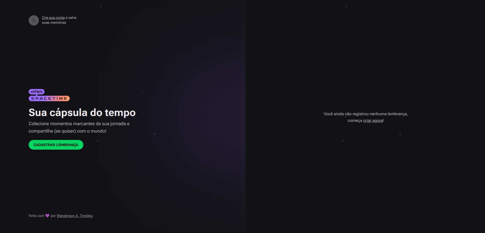
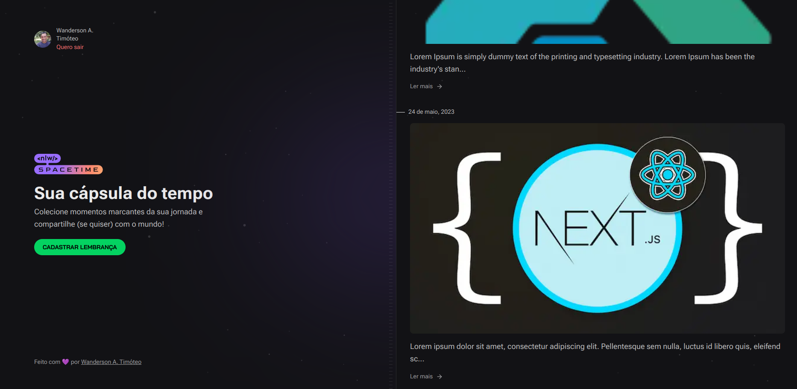
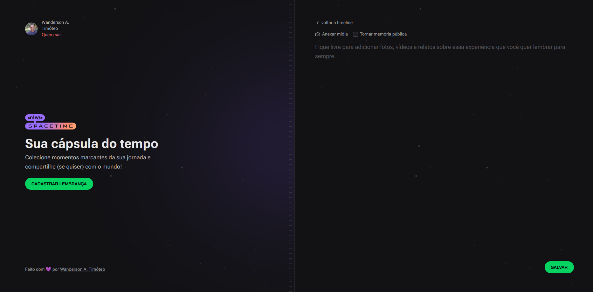
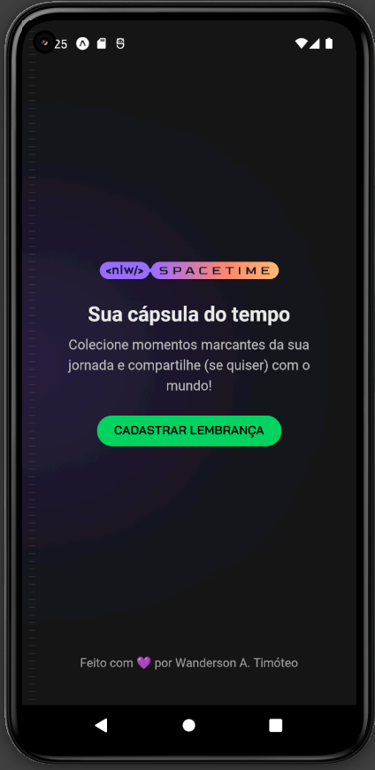

<h1 align="center">
  
  
</h1>

<div align="center">
  <a href="#-projeto">Projeto</a>&nbsp;&nbsp;&nbsp;|&nbsp;&nbsp;&nbsp;
  <a href="#-tecnologias">Tecnologias</a>&nbsp;&nbsp;&nbsp;|&nbsp;&nbsp;&nbsp;
  <a href="#-licença">Licença</a>&nbsp;&nbsp;&nbsp;|&nbsp;&nbsp;&nbsp;
  <a href="#-autor">Autor</a>
</div>

<br>

<p align="center">
  
  
  
</p>

<br>

## 💻 Projeto

Aplicação de recordação de memórias, onde o usuário poderá adicionar à uma timeline textos, fotos e vídeos de acontecimentos marcantes da sua vida, organizados por mês e ano.
<br>

### SpaceTime Gif

<p align="center">
    
</p>
<br>

### Home sem login

<p align="center">
    
</p>

<br>

### Home logado

<p align="center">
    
</p>

<br>

### Cadastrar Memorias

<p align="center">
    
</p>

<br>

### Spacetime Mobile

<p align="center">
    
</p>

<br>

### SpaceTime Vídeo

<p align="center">
    <video src=".github/specetime.mkv" autoplay>
      Desculpa, o seu navegador não suporta vídeos incorporados.
    </video>
</p>
<br>

## 🚀 Tecnologias

Esse projeto foi desenvolvido com as seguintes tecnologias e ferramentas:

<div align="center">
  
  
  
  
  
  
  
   
   
</div>

<br>

## 🔥 Executar Aplicação

### 🎇 Executando Localmente a Aplicação

Caso você deseja executar o projeto na sua máquina local, você precisará instalar o Node.js 18.\* em sua máquina. Após a instalação, basta seguir os passos abaixo:

### 🌀 Começando...

Para começar, você deve simplesmente clonar o repositório do projeto na sua máquina.

Navegue até o local onde você clonou o projeto, exemplo:

```sh
C:\Users\NomeDoComputador\Documents\CloneDoProjeto
```

#### ❗️ Instalando as Dependências (via Windows):

Bom, agora que clonou o projeto **(dentro da pasta `spacetime`)** contém 3 subpastas, sendo:

**`Mobile ->`** Contendo o app desenvolvido com React Native.

**`Server ->`** Contendo o back-end da aplicação desenvolvido em Node.js e Typescript.

**`Web ->`** Contendo o front-end da aplicação desenvolvido em React.js com Next.js e Typescript.

Agora abra um CMD ou terminal ou prompt de comando e acesse cada aplicação e digite a seguinte instrução:

```sh
npm install
```

ou

```sh
yarn install
```

Ao digitar a instrução acima para cada serviço, automaticamente ele irá baixar todas as dependências listadas e definidas no arquivo package.json:

- `node_modules` - que contêm os packages do npm que precisará para o projeto.

<br>

### 🛰️ Executando o projeto

Após baixar todas as dependências é só digitar no terminal a instrução abaixo:

## **`Sever`**

Para criar o Banco de Dados usando o Prisma:

```sh
npx prisma migrate dev
```

Para acessar o Banco de Dados:

```sh
npx prisma studio
```

Para executar o projeto server:

```sh
npm run dev
```

ou

```sh
yarn dev
```

## **`Web`**

Para executar o projeto web:

```sh
npm run dev
```

ou

```sh
yarn dev
```

## **`Mobile`**

Para executar o projeto mobile:

```sh
npm run start
```

ou

```sh
yarn start
```

Pronto! dessa forma o projeto `spacetime` estará rodando localmente em sua maquina. Acesse no navegador o endereço abaixo:

**Projeto Web**

```sh
http://localhost:3000
```

**Projeto Server**

```sh
http://localhost:3333
```

**Projeto Mobile**

É preciso acessar com um simulador Android ou IOS o Expo, se você não sabe e deseja aprender como acessar uma aplicação React Native com Expo, assista ao [vídeo](https://www.youtube.com/watch?v=eSjFDWYkdxM) ou leia o [artigo](https://react-native.rocketseat.dev/expo-managed/windows#expo-go).

Também é possível acessar o Expo com seu smartphone, para isso você precisará baixar o app Expo na loja de aplicativos do seu Smartphone e espelhar seu dispositivo com o seu desktop via USB. Para aprender como espelhar assista ao [vídeo](https://www.youtube.com/watch?v=ac5ShxByuxo).
<br>

## 🚩 Tenho Dúvidas... O que fazer?

Caso tenha dúvidas sobre o código do projeto, sintam-se a vontade em abrir uma **[ISSUE AQUI](https://github.com/Wanderson-A-Timoteo/spacetime/issues)**. Assim que possível, responderei todas as dúvidas!

<br>

## 💡 Licença

Esse projeto está sob a licença MIT. Veja o arquivo [LICENSE](.github/LICENSE.md) para mais detalhes.

<br>

## 🎆 Autor

Feito com ♥ by

<div align='center'>

[<br><sub>Wanderson A. Timóteo</sub>](https://www.wandersontimoteo.ga/)

</div>

<br>

## 🤝 Agradecimentos

<p align="center">
    
</p>
<br>

Projeto desenvolvido durante a Next Level Week 12.0 Spacetime da [Rocketseat](https://www.youtube.com/watch?v=awRtgpRsdTQ).

Agradecimento ao [Diego Fernandes](https://www.instagram.com/dieegosf/) por compartilhar conteúdo relevante e com qualidade de ensino.
